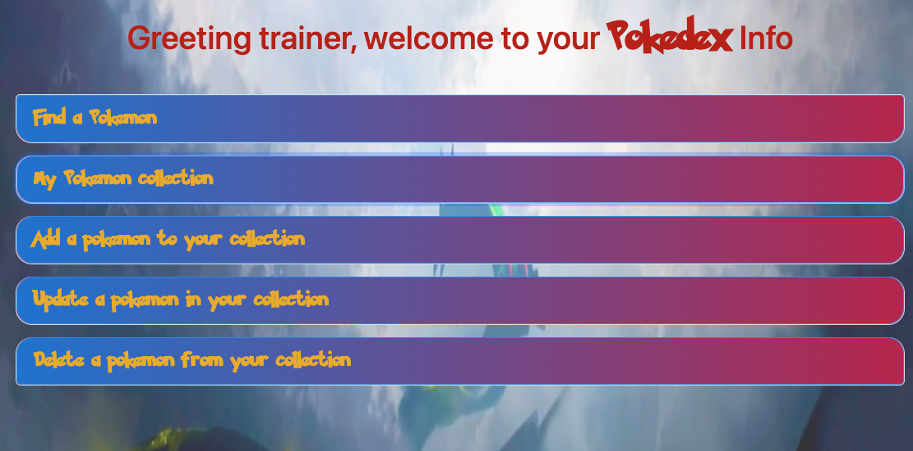
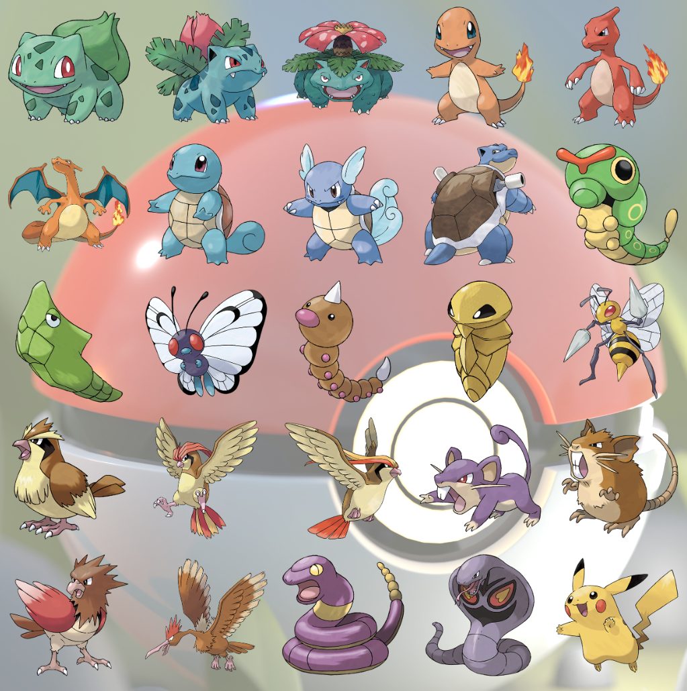

# JPACRUDProject
## Project home page
http://52.14.238.144:8080/BootMVCPokemonStats/
This project has been deployed on AWS using Tomcat 10 as server. I sincerely invite you to check out this application.

## Description
This is an application allowing users to Create, Retrieve, Update, and Delete (CRUD) Pokemons their favorite collection. 

- Users can view a cool collection of all the pokemon of their choice all in once place, including the strongest and the weakest in the set. The colletion is auto updated as new pokemon is added.

- Users can perform CRUD operations on the Pokemon collection  from the dashboar menu or interactively through the pokemon info page. The application is designed to be responsive to both users' device and interaction.
 

- Users can choose among hundreds of pokemons to add to the collection. There are more than a thousand pokemons for you to explore.

- Users are free to interact with the app and explores different routes through the app without worrying about sudden unhandled error. I got you covered.

This application has been running through many comprehensive stress test scenarios, such as boundary data and empty dataset, to ensure the smoothness in user experience. Emerge yourself through a discovery journey that is only limited by your immagination.

## Technology used
- Frontend: Java JSP/ JSTL, HTML, CSS, and Bootstrap.
- Backend: Java JPA, JPQL, String MVC, Boot, Gradle and MySQL.

This is a fullstack application. In the front end, Java JSP/ JSTL,  HTML, CSS, and Bootstrap are employed to make the page responsive with various device viewports.

In the back end, Java Spring MVC, Boot, JPQL, and Hibernate are used to control the routes, the end points, and interact with the MySQL database. JPA is used for Object-Relation-Mapping, and Gradle is used to manage libraries, drivers, frameworks, and dependencies.

This application is built with responsiveness and user experience in mind. Many complicated routings and data transfers have been carefully handled by combinations of Java backend technology, most notably by Spring, Boot, and Hibernate, to ensure smoothness of connection, user data handling, and user experience.

## Limitation
Because of time limitation, the app may not be styled to look professional grade. However, all the basic concepts of CRUD has been met through rigorous implementations and testinngs. Some expanding features, such as finding and retrieving a list of pokemon, expanding pokemon dataset and attributes, and making the pokemon evolution tree, are subjected for future development.

## Lesson Learned
Java backend frameworks make interaction with database and routing to different endpoints deceptively simple. However, as the library and packages aare being revised and updated every day, it is crucial to choose the right version and make the right set up for the project.

In addition to that, there is no fixed ruleset on how the users would interact with the database. Thus, an application has to go through a rigorous testing process to limit the unhandled errors and exceptions. I code a little, test a little on each functionality and apply various scenarios of stress tests on the final product to make sure every feature work as it should.